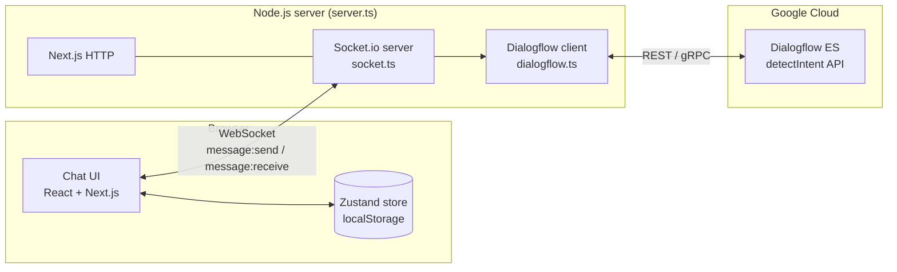
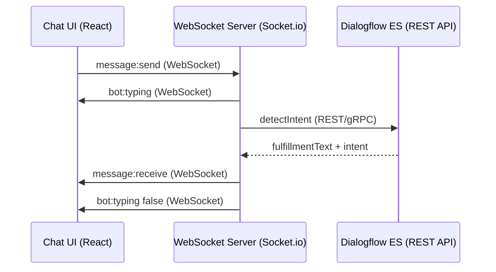

# Dialogflow Chat UI

A real-time chat application that connects a React frontend to **Google Dialogflow ES** through a **WebSocket** server. Users send messages over Socket.io; the server forwards them to Dialogflow via the REST/gRPC API and relays the bot reply back to the client.

## Architecture

### Component overview



### Message flow



| Layer | Technology | Role |
|-------|------------|------|
| Frontend | Next.js, React, Socket.io client | Chat UI, session state (Zustand) |
| Server | Node.js, Socket.io, custom `server.ts` | WebSocket hub, Dialogflow bridge |
| NLP | Dialogflow ES (`@google-cloud/dialogflow`) | Intent matching and bot responses |

**Design decisions**

- **Socket.io** is used instead of raw WebSockets for automatic reconnection and event-based messaging. It runs over the WebSocket transport in the browser.
- **Custom server** (`server.ts`) hosts both Next.js (HTTP) and Socket.io on the same port so the UI and WebSocket share one origin in development.
- **Session IDs** are UUIDs per chat thread so Dialogflow can track multi-turn context via `projects/{project}/agent/sessions/{sessionId}`.
- **Zustand + persist** stores chat history in `localStorage` with SSR-safe hydration to avoid React hydration mismatches.

## Prerequisites

- Node.js 18+
- A [Google Cloud](https://console.cloud.google.com/) project with **Dialogflow API** enabled
- A **Dialogflow ES** agent with at least default intents (Welcome, Fallback)
- A **service account** JSON key with **Dialogflow API Client** (or Admin) role

## Dialogflow ES setup

1. Open the [Dialogflow ES Console](https://dialogflow.cloud.google.com/) and create or select an agent.
2. Enable the **Dialogflow API** in Google Cloud Console for your project.
3. Create a service account, download the JSON key, and save it locally:

   ```text
   credentials/service-account.json
   ```

   This folder is gitignored — never commit credentials.

4. Add training phrases and responses to your intents (e.g. Default Welcome Intent).
5. Note your **GCP Project ID** (used as `DIALOGFLOW_PROJECT_ID`).

## Local setup

### 1. Clone and install

```bash
git clone https://github.com/MoizYousuf/chat-ui-dialogueflow.git
cd chat-ui-dialogueflow
npm install
```

### 2. Environment variables

Copy the example file and fill in your values:

```bash
cp .env.example .env
```

| Variable | Required | Description |
|----------|----------|-------------|
| `DIALOGFLOW_PROJECT_ID` | Yes | GCP project ID for your Dialogflow agent |
| `GOOGLE_APPLICATION_CREDENTIALS` | Yes (local) | Path to service account JSON |
| `GOOGLE_CREDENTIALS_BASE64` | Production alt | Base64-encoded JSON instead of file path |
| `PORT` | No | Server port (default: `3000`) |
| `NEXT_PUBLIC_SOCKET_URL` | No | Socket.io URL (default: `http://localhost:3000`) |
| `NEXT_PUBLIC_APP_URL` | Production | CORS origin for Socket.io |

### 3. Run the app

Use the custom server (not `next dev`):

```bash
npm run dev
```

Open [http://localhost:3000](http://localhost:3000).

Production:

```bash
npm run build
npm start
```

## WebSocket events

| Event | Direction | Payload | Purpose |
|-------|-----------|---------|---------|
| `session:new` | Client → Server | `{ sessionId }` | Log new chat session |
| `message:send` | Client → Server | `{ sessionId, text, timestamp }` | User message to Dialogflow |
| `message:receive` | Server → Client | `{ sessionId, text, intent, confidence, timestamp }` | Bot reply |
| `bot:typing` | Server → Client | `{ sessionId, isTyping }` | Typing indicator |

## Project structure

```text
chat-ui-dialogueflow/
├── server.ts                 # HTTP + Socket.io entry point
├── src/
│   ├── app/                  # Next.js pages and layout
│   ├── components/           # Chat UI components
│   ├── hooks/useChat.ts      # Socket.io client + store bridge
│   ├── lib/
│   │   ├── dialogflow.ts     # Dialogflow ES detectIntent
│   │   └── socket.ts         # Socket.io server handlers
│   ├── store/chatStore.ts    # Zustand session/message state
│   └── types/index.ts        # Shared TypeScript types
├── credentials/              # Service account JSON (gitignored)
├── .env.example
└── README.md
```

## Error handling

- **Dialogflow failures** — `socket.ts` catches errors and emits a friendly fallback message; the typing indicator is always cleared in `finally`.
- **Missing credentials** — Server starts even if credentials are missing; Dialogflow calls fail at runtime with a logged error and user-facing fallback.
- **WebSocket disconnect** — Socket.io reconnects automatically; `ChatHeader` shows connection status.
- **SSR / hydration** — Persisted chat sessions load after mount via `skipHydration` and `useSyncExternalStore` to keep server and client HTML in sync.

## Exporting your Dialogflow agent

For submission or backup:

1. Dialogflow ES Console → **Settings (gear)** → **Export and Import**
2. Click **Export as ZIP**
3. Keep the ZIP for your records or assignment submission

## Troubleshooting

| Issue | Fix |
|-------|-----|
| Bot says "Sorry, I ran into a problem" | Check `DIALOGFLOW_PROJECT_ID`, credentials path, and Dialogflow API permissions |
| Socket won't connect | Run `npm run dev` (not `next dev`); verify `NEXT_PUBLIC_SOCKET_URL` |
| Default Fallback responses | Add training phrases in Dialogflow for the phrases you test |
| Hydration warnings | Clear `localStorage` key `dialogflow-chat-sessions` and hard-refresh |

## Scripts

| Command | Description |
|---------|-------------|
| `npm run dev` | Start development server (Next.js + Socket.io) |
| `npm run build` | Build Next.js for production |
| `npm start` | Run production server |
| `npm run lint` | Run ESLint |

## License

Private assessment / educational project.
